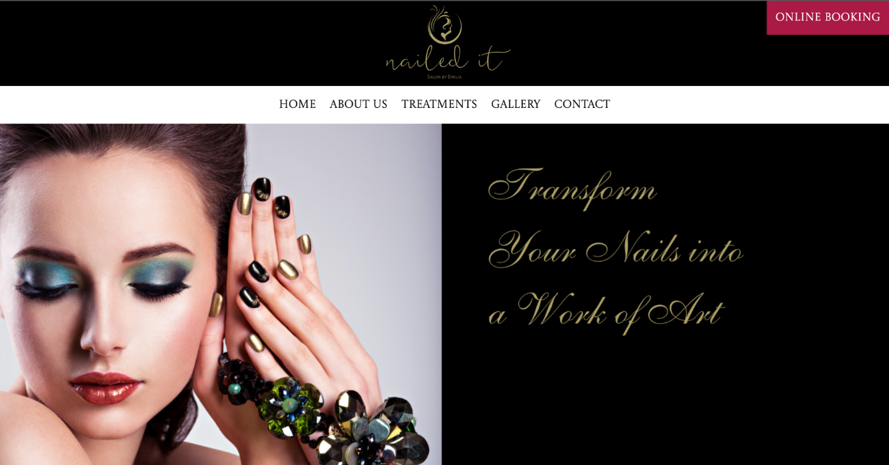

# Final Project at DCI (Digital Career Institute)
## Web Development Orientation Course👩🏻‍💻
### Version 2 - Edited for Responsive Design

My final project for the Web Development Orientation Course at DCI (Digital Career Institute).  
This is the Version 2, edited for responsive design.

🔗 Please click here to visit the website.  
[nailed it Salon By EMILIA](https://yukosuga.github.io/nailed-it-salon-by-emilia/) 💅✨

The [original](https://yukosuga.github.io/my-first-webpage/) version had an unresponsive design.  
It was created for the device-width 1519,20px.

